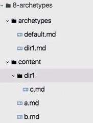

# Archetypes

[https://www.youtube.com/watch?v=bcme8AzVh6o&list=PLLAZ4kZ9dFpOnyRlyS-liKL5ReHDcj4G3&index=8](https://www.youtube.com/watch?v=bcme8AzVh6o&list=PLLAZ4kZ9dFpOnyRlyS-liKL5ReHDcj4G3&index=8)

Archetypes define a structure for files which will be created.

➡️ There is a default one here `/archetypes/default.md` :

```markdown
---
title: "{{ replace .TranslationBaseName "-" " " | title }}"
date: {{ .Date }}
draft: true
---
```

→ defines the default structure of every page created by hugo

### Specify different archetypes

➡️ We can do so by naming the archetype after a folder in our content directory



The `[dir1.md](http://dir1.md)` file in the archetypes folder will be used for every .md file in `/content/dir1/...` . So we can specify different Front Matters for files.

**Or you can specify the archetype when creating new files:**

```bash
hugo new --kind subsection blog/subsection/mypost.md
```

Which will pick the `subsection.md` archetype template, but there is no “auto support”.
