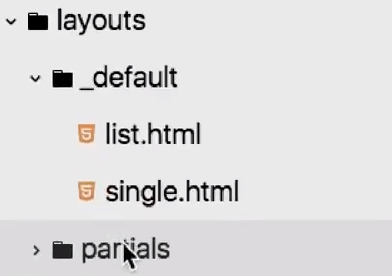

# Partial Templates

Or: How to make HUGO modular.

[https://www.youtube.com/watch?v=pjS4pOLyB7c](https://www.youtube.com/watch?v=pjS4pOLyB7c)

Used for eg.: header, footer, etc.



The partials will be stored in a folder called

 `/layouts/partials/`

and given a name referring to the encapsulated html element.

### Referencing partial in the `_default` files

Here is how we do it:

```
{{ partials "[nameOfPartial]" . }}
```

⚠️ the `.` is the scope passed into the partial. Which means I'm passing down all variables of the current scope to the partial.

### Passing data instead of the whole scope (`.`)

Here is how we do it:

```
{{ partials "[nameOfPartial]" (dict "myVar" "myVarValue" "myOtherVar" "myOtherVarValue") }}
```

```html
<h1>{{ .myVar }}</h1>
<p>{{ .myOtherVar }}<p>
```

⚠️ As a default we should use the `.` though.
