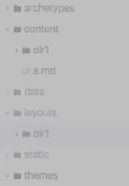

# Section Templates

[https://www.youtube.com/watch?v=jrMClsB3VsY](https://www.youtube.com/watch?v=jrMClsB3VsY)

ℹ️ we just create a folder structure in the layouts folder with the same naming in the content folder

There is a `content/dir1` folder. So to style this one with a specific layout we have to create `layouts/dir1` to do so. In there we can create specific stylings with `single.html | list.html | etc.` for each file.
